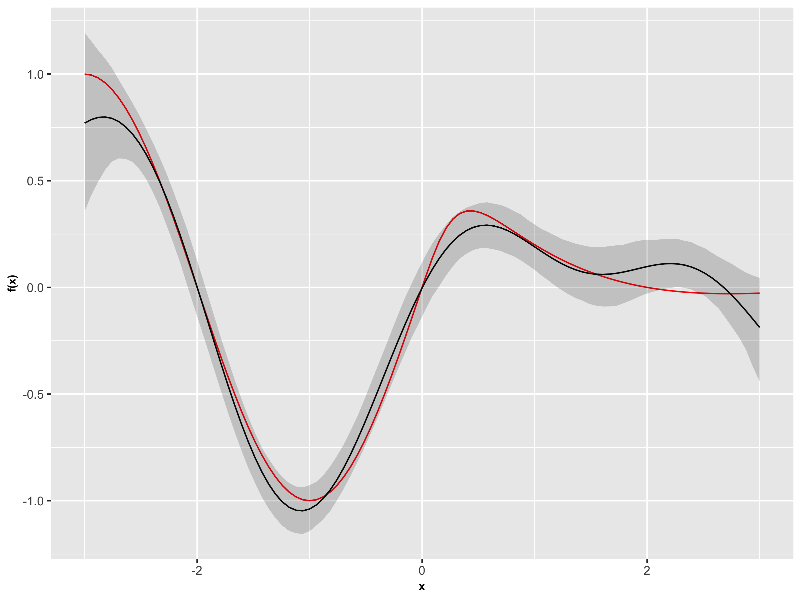

# Gaussian-Process-with-Errors-in-Variables
Covariate measurement error in nonparametric regression is a common problem in nutritional epidemiology and geostatistics. Over the last two decades, this problem has received substantial attention from frequentists. Bayesian methods for measurement error models have only been explored recently and are known to be successful. We also develop a novel surrogate for a Gaussian process as a prior for the unknown function which results in efficient computation and preserves the covariance of a Gaussian process, thereby facilitating easy prior elicitation.

# Model 
Obseved value: (W_i, Y_i)
Unknown true covariate: X_i
Unknown regression function: f
Measurement error: u_i

Y_i = f(X_i) + e_i,  e_i ~ N(0,1); 
W_i = X_i + u_i,  u_i ~ N(0, delta^2) 

Goal: estimate f as well as the marginal density of X

# Required packages
fields; mvtnorm; matrixStats; stats; FSA; ggplot2

# Output 

red line - true; black line - GPEV estimation; light shade - 95% pointwise credible intervals. 
